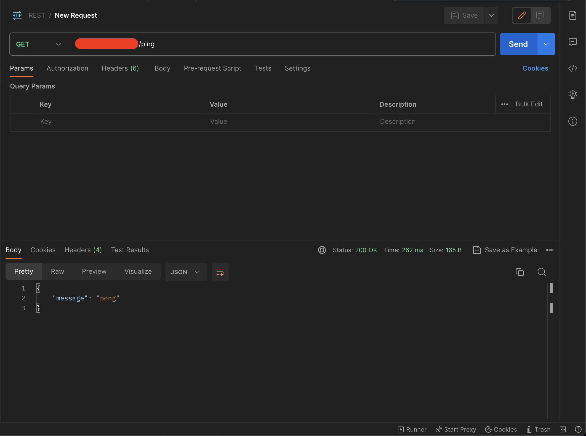

# Right sizing your pods

This repo contains a simple Go Web Server and contains only one route `/ping`. The goal of this repo is to demonstrate the implications of not setting your kubernetes cpu limits right on API response times.

# Requirements
1. A Kubernetes Cluster
3. Kubectl cli
4. Helm cli
5. Postman(a version which has the performance testing feature)

## Process
**Note before you start: All testing was done on Azure's AKS(because I had some credits remaining and didn't want to let it go to waste) so please do adjust the manifests to match your choice of cluster**

1. Install prometheus on your Kubernetes Cluster:
    ```bash
    helm repo add prometheus-community https://prometheus-community.github.io/helm-charts

    helm repo update

    helm install joyboy prometheus-community/prometheus --set alertmanager.enabled=false --set prometheus-node-exporter.enabled=false --set prometheus-pushgateway.enabled=false
    ```
    The above commands will install the only two things that we need KSM and Prometheus Server

2. In a different terminal run a port-forward to access the prometheus server by executing:
    ```bash
    kubectl port-forward svc/joyboy-prometheus-server 8081:http
    ```
3. We are first going to deploy the application as is without any modification. So apply the `deployment.yaml` present in this repo.
    ```bash
    kubectl apply -f deployment.yaml
    ```

    **Note: The pod running on the cloud provider will be restricted to 2 vCPU's and can be found in the deployment.yml file**

4. Install the Nginx Ingress Controller to handle the traffic for your application by running:
    ```bash
    helm install ingress-nginx ingress-nginx/ingress-nginx \
    --create-namespace \
    --namespace $NAMESPACE \
    --set controller.service.annotations."service\.beta\.kubernetes\.io/azure-load-balancer-health-probe-request-path"=/healthz
    ```

    And then apply the `ingress.yml` present in this folder by running:
    ```bash
    kubectl apply -f ingress.yml
    ```
    And get the IP associated with your ingress object by running:
    ```bash
    kubectl get ingress
    ```

5. Now that we have our app deployed let's sort of get a baseline on the latency of the application. From testing this locally the server takes 20-60µs.

    Latency when running the API locally:
    

    Latency when hosted on Azure in US East Zone 1:
    

