# Right sizing your pods (CPU Edition)

This repo contains a simple Go Web Server and contains only one route `/ping`. The goal of this repo is to demonstrate the implications of not setting your kubernetes cpu limits right on API response times.

# Requirements
1. A Kubernetes Cluster
3. Kubectl cli
4. Helm cli
5. Postman(a version which has the performance testing feature)

## Process
**Note before you start: All testing was done on Azure's AKS(because I had some credits remaining and didn't want to let it go to waste) so please do adjust the manifests to match your choice of cluster**

1. Install prometheus on your Kubernetes Cluster:
    ```bash
    helm repo add prometheus-community https://prometheus-community.github.io/helm-charts

    helm repo update

    helm install joyboy prometheus-community/prometheus --set alertmanager.enabled=false --set prometheus-node-exporter.enabled=false --set prometheus-pushgateway.enabled=false
    ```
    The above commands will install the only two things that we need KSM and Prometheus Server

2. In a different terminal run a port-forward to access the prometheus server by executing:
    ```bash
    kubectl port-forward svc/joyboy-prometheus-server 8081:http
    ```
3. We are first going to deploy the application as is without any modification. So apply the `deployment.yaml` present in this repo.
    ```bash
    kubectl apply -f deployment.yaml
    ```

    **Note: The pod running on the cloud provider will be restricted to 2 vCPU's and can be found in the deployment.yml file**

4. Install the Nginx Ingress Controller to handle the traffic for your application by running:
    ```bash
    helm install ingress-nginx ingress-nginx/ingress-nginx \
    --create-namespace \
    --namespace $NAMESPACE \
    --set controller.service.annotations."service\.beta\.kubernetes\.io/azure-load-balancer-health-probe-request-path"=/healthz
    ```

    And then apply the `ingress.yml` present in this folder by running:
    ```bash
    kubectl apply -f ingress.yml
    ```
    And get the IP associated with your ingress object by running:
    ```bash
    kubectl get ingress
    ```

5. Now that we have our app deployed let's sort of get a baseline on the latency of the application. From testing this locally the server takes 50-100µs.

    Latency when running the API locally:
    

    Latency when hosted on Azure in US East Zone 1:
    


6. Now lets run a performance test on the API with the same setup above with 2 concurrent users. Given that net/http creates a new Go routine for each request it should be able to run parallely on the available 2vCPU's with no impact on the response time.
    - With 2 Virtual User's:
        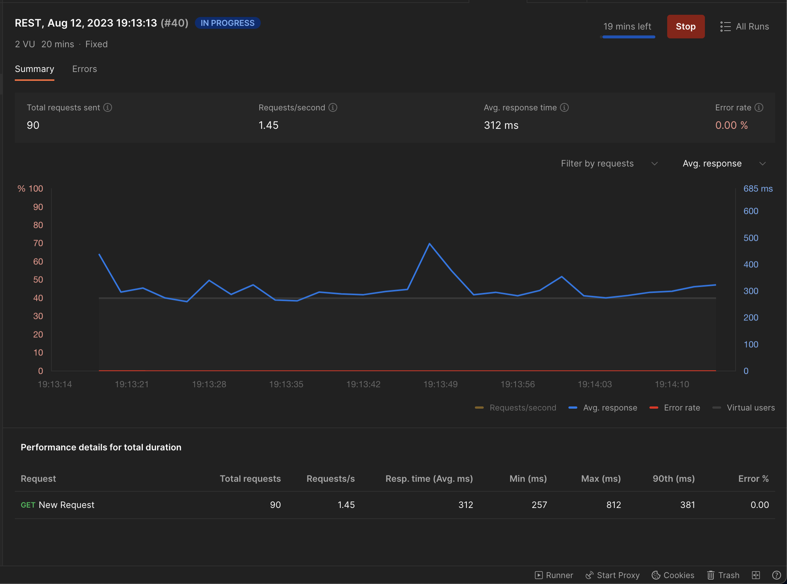
        It had no impact on response times and the response times were in the expected range.
        
        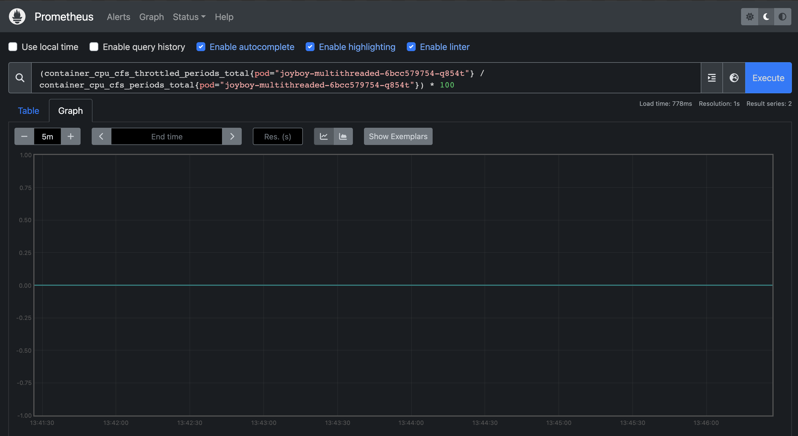
        We observed no throttling at all.
    - Instead of ramping up the virtual users in small increments I'm going to just cut to me using 100VU's and this seems to be Postman's limit since the the time it takes to process each request is so extremely negligible in comparison to the Kubernetes CFS period(100ms) it should still have no effect on the overall latency and throttling
        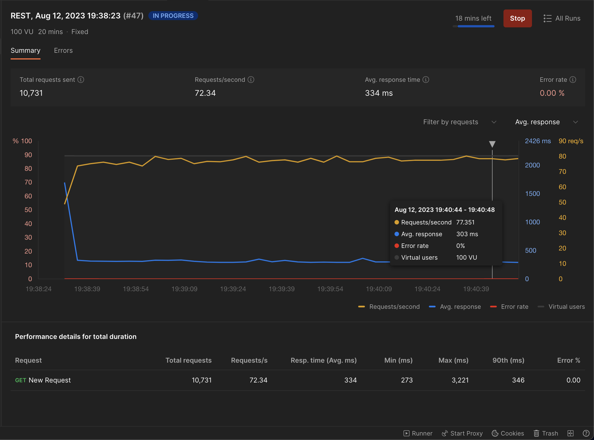
        It had no impact on response times.
        
        
        We observed no throttling at all.

7. Let's now so how badly throttling affects API response times. Uncomment the following line:
    ```bash
    - image: pol905/gooneoone:slow-amd64 
    ```
    in the deployment.yml file and comment out the following:
    ```bash
    - image: pol905/gooneoone:fast-amd64 
    ```
    This will make use of the docker image that contains a for loop that loops over billion times before responding to the request. Now lets try to get the baseline response time for this modified API.

    Latency when running the API locally:
    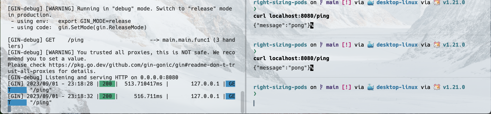

    Latency when hosted on Azure in US East Zone 1:
    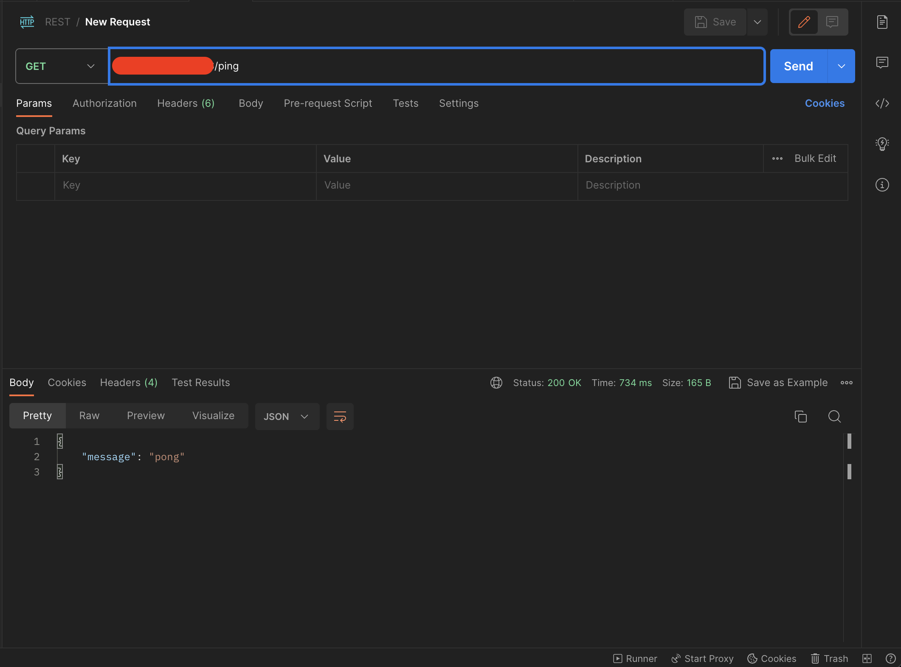

8. Given the API takes about ~500ms to process each request. Let's run some benchmarks on this modified API and see what our response time looks like as we ramp up the number of concurrent users.
    - With 2 Virtual Users:
    
        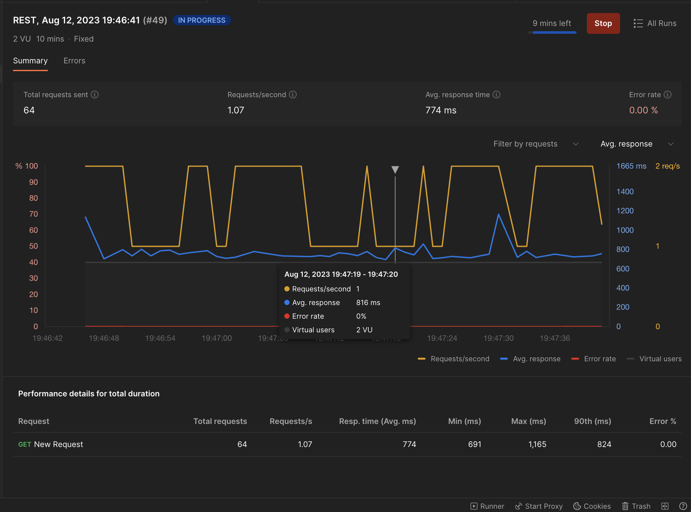
        The average response time was in the range of what we saw from azure.

        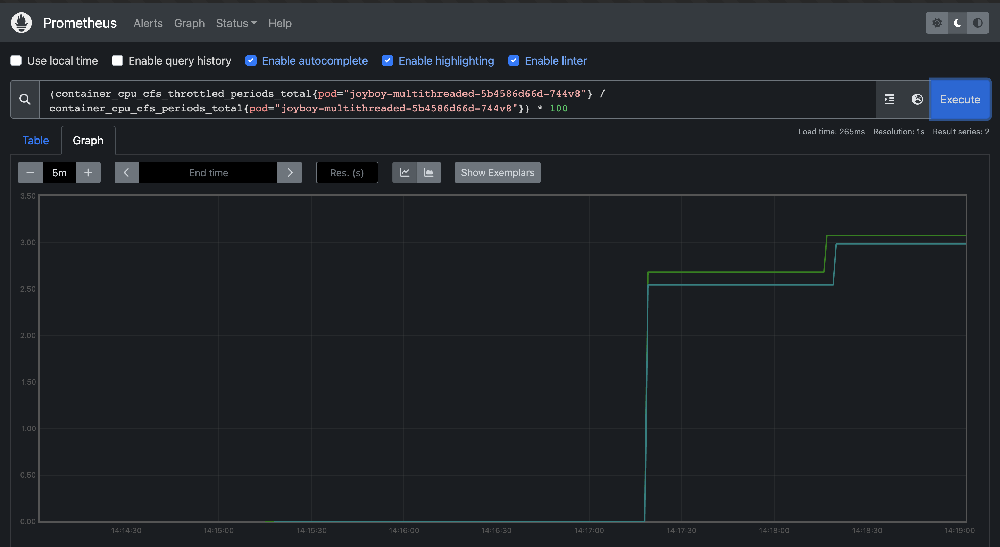
        We already start seeing throttling but its very low.

    - With 5 Virtual Users:

        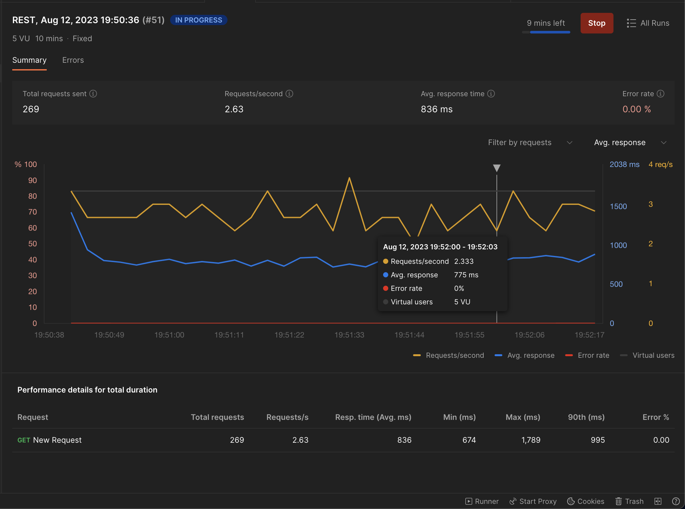
        The average response time got worse in comparison to 2VU.

        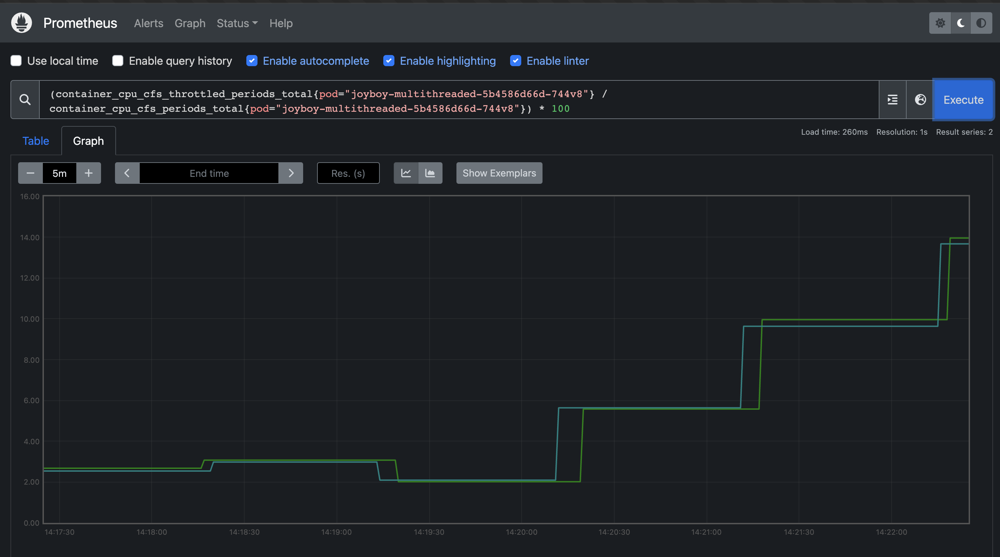
        Throttling increases > 10%.
    
    - With 10 Virtual Users (Things are about to get worse):

        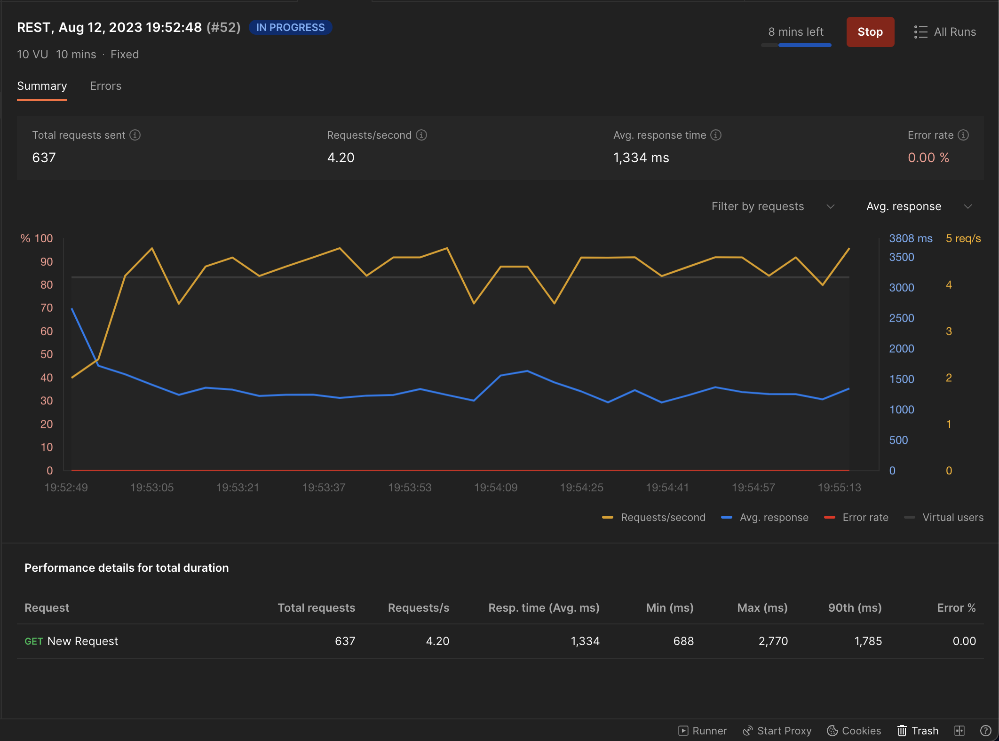
        API response times are almost 2X our baseline :(.

        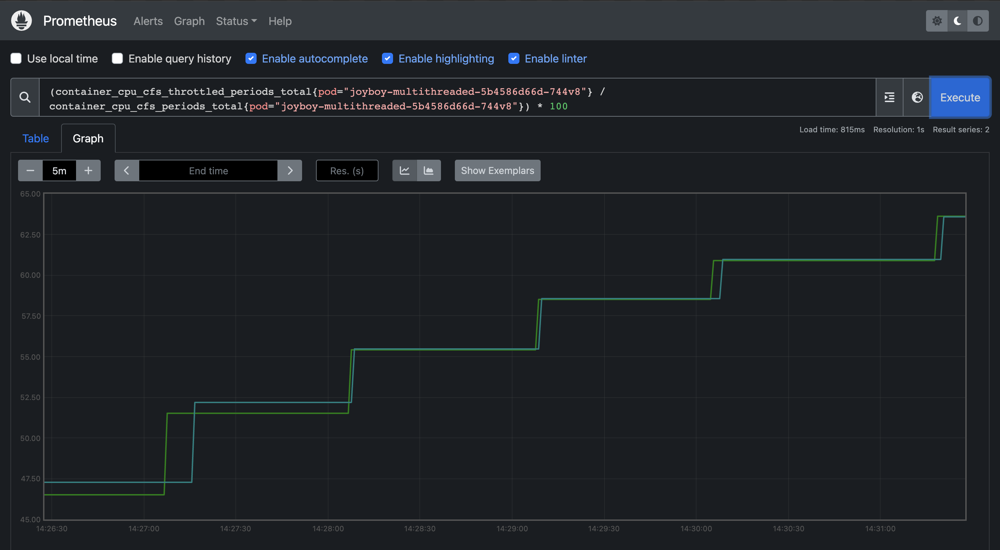
        Throttling shot up to ~65%.


## Conclusion

Its safe to say that we need the CPU to continue processing the same request even after it exceeds the Kubernetes CFS period of 100ms so **as a rule of thumb if your requests takes < 100ms to process a request it might be easier to just approximate your CPU requirements looking at your throttling trendlines and your concurrency requirements but if it is > 100ms you would need to assign 1 core for every parallel request that you want to serve. For example, lets say you need to serve 6 requests parallely then you would need to assign 6 cores in your kubernetes limits.**


