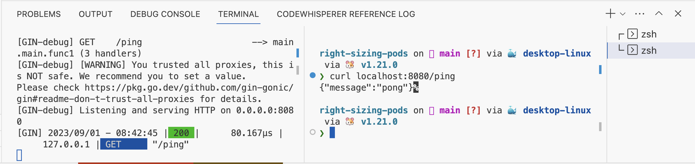

# Right sizing your pods

This repo contains a simple Go Web Server and contains only one route `/ping`. The goal of this repo is to demonstrate the implications of not setting your kubernetes cpu limits right on API response times.

# Requirements
1. Docker Desktop/Rancher Desktop
2. Minikube/Kubernetes enabled in Docker Desktop/Rancher Desktop
3. Kubectl cli
4. Helm cli
5. Postman(a version which has the performance testing feature)

## Process
1. First we are going to deploy the app as is onto a cloud provider(in this case Azure because I had some credits remaining and didn't want to let it go to waste) and sort of get a baseline on the latency of the application. From testing this locally the server takes 20-60µs.

